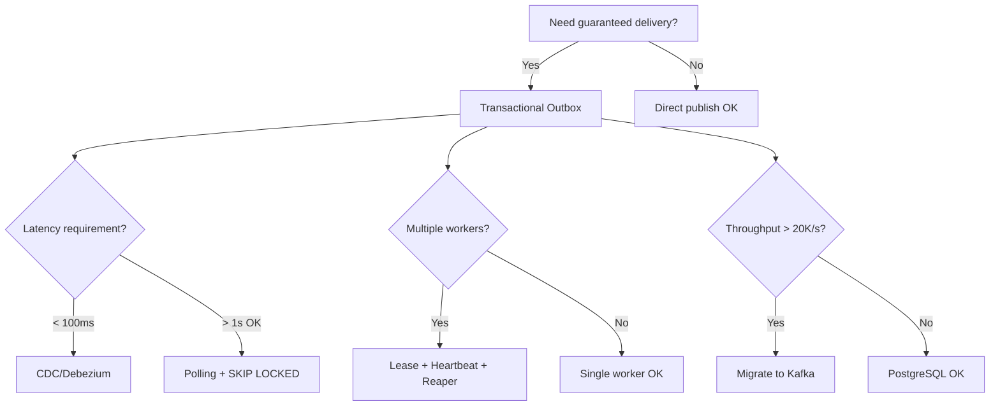

# Transactional Outbox Architect

This skill provides comprehensive guidance for implementing production-grade Transactional Outbox patterns using PostgreSQL and Node.js, ensuring transactional consistency in distributed systems.

## Core Problem: The Dual-Write Anti-Pattern

The fundamental challenge: atomically updating local state AND notifying external systems.

```
❌ Anti-Pattern (Dual-Write):
BEGIN TRANSACTION → UPDATE orders → COMMIT → PUBLISH to Kafka
                                              ↑ If this fails, systems are inconsistent
```

```
✅ Transactional Outbox:
BEGIN TRANSACTION → UPDATE orders → INSERT into outbox → COMMIT
                    (async worker reads outbox and publishes)
```

> [!IMPORTANT]
> **This is NOT a message broker.** The Transactional Outbox guarantees **at-least-once** delivery with **no ordering guarantees** across partitions. Ordering and deduplication are the **consumer's responsibility**.

---

## Consumer Contract: Mandatory Idempotency

Every event includes a `tracking_id` (UUID). Consumers **MUST** implement idempotency:

```typescript
// Before processing ANY event
const alreadyProcessed = await checkIdempotency(pool, event.tracking_id);
if (alreadyProcessed) {
  return; // Skip duplicate
}

// Process event...

// For external APIs, combine tracking_id + fencing token
const idempotencyKey = `${event.tracking_id}-${event.lock_token}`;
await stripe.charges.create({ ... }, { idempotencyKey });
```

> [!CAUTION]
> **No consumer may be promoted to production without verified idempotency mechanism.**

---

## Lease & Heartbeat Mechanism

To prevent zombie workers (processes that stopped responding but didn't die):

```
┌─ Worker claims event ─┐
│  locked_until = NOW() + 30s
│
├─ Every 10s: Heartbeat ─┐
│  locked_until = NOW() + 30s (renewed)
│
├─ Processing completes ─┐
│  status = COMPLETED, locked_until = NULL
│
└─ If worker dies: ─────┐
   Reaper recovers after locked_until expires
```

### Worker Configuration

```typescript
const worker = new OutboxWorker(pool, handler, {
  leaseSeconds: 30,        // Lock duration
  heartbeatIntervalMs: 10000, // Renewal interval (< leaseSeconds)
});
```

---

## Reaper Process

The Reaper recovers stale events where lease expired:

```sql
-- Run every 10 seconds
UPDATE outbox
SET status = 'PENDING', locked_until = NULL, lock_token = NULL
WHERE status = 'PROCESSING' AND locked_until < NOW();
```

The worker includes an in-process Reaper (configurable):

```typescript
const worker = new OutboxWorker(pool, handler, {
  reaperEnabled: true,
  reaperIntervalMs: 10000,
});
```

---

## Dead Letter Event (DLE) Governance

Events that fail `max_retries` times are moved to `DEAD_LETTER` status.

### Policy

| Retry | Backoff | Notes |
|-------|---------|-------|
| 1-3 | Immediate | Transient failures |
| 4-5 | Exponential + jitter | Rate limiting |
| > 5 | Move to DLE | Requires manual intervention |

### Redrive Procedure

```sql
-- After fixing root cause
UPDATE outbox
SET status = 'PENDING', retry_count = 0, last_error = NULL
WHERE status = 'DEAD_LETTER' AND event_type = 'OrderCreated';
```

### Upcasting for Schema Evolution

When payload schema changes, apply transformations at read-time:

```typescript
const upcasters = [
  { version: 1, up: (p) => ({ ...p, currency: p.currency ?? 'USD' }) }
];
```

📚 **Full runbook**: [dle-runbook.md](file:///c:/Users/fabio/_WORKER_/Personal/pg-transactional-outbox/.agent/skills/transactional-outbox-architect/resources/dle-runbook.md)

---

## Outbox Table Design

```sql
CREATE TABLE outbox (
  id              BIGSERIAL,
  tracking_id     UUID NOT NULL DEFAULT gen_random_uuid(),
  aggregate_id    UUID NOT NULL,
  aggregate_type  TEXT NOT NULL,
  event_type      TEXT NOT NULL,
  payload         JSONB NOT NULL,
  metadata        JSONB DEFAULT '{}',
  created_at      TIMESTAMPTZ NOT NULL DEFAULT NOW(),
  processed_at    TIMESTAMPTZ,
  status          TEXT NOT NULL DEFAULT 'PENDING',
  retry_count     INT NOT NULL DEFAULT 0,
  max_retries     INT NOT NULL DEFAULT 5,
  locked_until    TIMESTAMPTZ,
  lock_token      BIGINT,
  last_error      TEXT,
  PRIMARY KEY (id, created_at)
) PARTITION BY RANGE (created_at);
```

📚 **Full schema**: [outbox-schema.sql](file:///c:/Users/fabio/_WORKER_/Personal/pg-transactional-outbox/.agent/skills/transactional-outbox-architect/resources/outbox-schema.sql)

---

## Propagation Strategies

### Polling with SKIP LOCKED + Lease

```sql
UPDATE outbox
SET status = 'PROCESSING', locked_until = NOW() + INTERVAL '30 seconds', lock_token = $1
WHERE id IN (
  SELECT id FROM outbox
  WHERE status = 'PENDING'
  ORDER BY created_at LIMIT 100
  FOR UPDATE SKIP LOCKED
)
RETURNING *;
```

### CDC (Change Data Capture)

| Attribute | Polling | CDC (Debezium/WAL) |
|-----------|---------|-------------------|
| Latency | Higher (poll interval) | Near real-time |
| DB Load | Continuous queries | Minimal (log reads) |
| Complexity | Low | High (replication setup) |

---

## Partitioning with pg_partman

```sql
SELECT partman.create_parent(
  p_parent_table := 'public.outbox',
  p_control := 'created_at',
  p_interval := 'daily',
  p_premake := 7
);

-- Retention policy
UPDATE partman.part_config
SET retention = '30 days', retention_keep_table = false
WHERE parent_table = 'public.outbox';
```

---

## PostgreSQL Sequence Mechanics

### Why Gaps Occur (Not Bugs!)

| Cause | Mechanism |
|-------|-----------|
| Rollback | `nextval()` not reversed on abort |
| `ON CONFLICT` | Sequence increments before conflict |
| Crash recovery | WAL replay may skip values |

> [!WARNING]
> Gapless sequences require **serialized transactions** → severe throughput penalty.

---

## Scale Ceiling

> [!CAUTION]
> PostgreSQL as outbox has a practical ceiling of **20,000–50,000 events/second**.

### Migration Triggers

Migrate to dedicated broker (Kafka) when ANY of:
- Sustained throughput > 20K events/sec
- Fan-out to > 10 consumers
- Event replay > 30 days needed
- Multi-region distribution required

📚 **Migration guide**: [migration-roadmap.md](file:///c:/Users/fabio/_WORKER_/Personal/pg-transactional-outbox/.agent/skills/transactional-outbox-architect/resources/migration-roadmap.md)

---

## High-Throughput Configuration

| Parameter | Recommendation | Impact |
|-----------|---------------|--------|
| `max_wal_size` | 2GB–16GB | Reduces checkpoint frequency |
| `autovacuum_vacuum_scale_factor` | 0.01 (1%) | Faster vacuum for high churn |
| `wal_buffers` | 64MB | Optimizes WAL buffering |
| `maintenance_work_mem` | 512MB–1GB | Faster VACUUM |

📚 **Full model**: [capacity-model.md](file:///c:/Users/fabio/_WORKER_/Personal/pg-transactional-outbox/.agent/skills/transactional-outbox-architect/resources/capacity-model.md)

---

## Observability

### Key Metrics

| Metric | Alert Threshold |
|--------|-----------------|
| Oldest pending event | > 5 minutes |
| Stale PROCESSING count | > 0 (if Reaper healthy) |
| DLE count per event_type | > 10 |
| Autovacuum dead tuples | > 100K |

### Distributed Tracing

Propagate `trace_id` and `span_id` in event metadata:

```typescript
const event = {
  payload: { ... },
  metadata: {
    trace_id: currentSpan.traceId,
    span_id: currentSpan.spanId,
  }
};
```

📚 **Incident response**: [incident-playbook.md](file:///c:/Users/fabio/_WORKER_/Personal/pg-transactional-outbox/.agent/skills/transactional-outbox-architect/resources/incident-playbook.md)

---

## Compliance & Retention

| Framework | Retention | Strategy |
|-----------|-----------|----------|
| GDPR/LGPD | "As needed" | Crypto-shredding |
| HIPAA | 6 years | Immutable audit logs |
| SOX | 7 years | Cold storage (S3) |

### Data Lifecycle

| Tier | Duration | Storage |
|------|----------|---------|
| Hot | 30 days | Active partitions |
| Cold | 30 days → 7 years | S3/Archive |
| Purge | > 7 years | Delete or anonymize |

### Crypto-Shredding for GDPR

```typescript
// Per-user encryption key
const userKey = await kms.generateDataKey({ userId });

// "Delete" = destroy key
await kms.deleteKey({ userId });
// Events become unreadable
```

---

## Decision Tree



---

## Resources

| Resource | Description |
|----------|-------------|
| [outbox-schema.sql](file:///c:/Users/fabio/_WORKER_/Personal/pg-transactional-outbox/.agent/skills/transactional-outbox-architect/resources/outbox-schema.sql) | Complete schema with indexes |
| [outbox-worker.ts](file:///c:/Users/fabio/_WORKER_/Personal/pg-transactional-outbox/.agent/skills/transactional-outbox-architect/examples/outbox-worker.ts) | Reference Node.js implementation |
| [dle-runbook.md](file:///c:/Users/fabio/_WORKER_/Personal/pg-transactional-outbox/.agent/skills/transactional-outbox-architect/resources/dle-runbook.md) | Dead Letter Event procedures |
| [capacity-model.md](file:///c:/Users/fabio/_WORKER_/Personal/pg-transactional-outbox/.agent/skills/transactional-outbox-architect/resources/capacity-model.md) | PostgreSQL sizing guide |
| [incident-playbook.md](file:///c:/Users/fabio/_WORKER_/Personal/pg-transactional-outbox/.agent/skills/transactional-outbox-architect/resources/incident-playbook.md) | Troubleshooting procedures |
| [migration-roadmap.md](file:///c:/Users/fabio/_WORKER_/Personal/pg-transactional-outbox/.agent/skills/transactional-outbox-architect/resources/migration-roadmap.md) | Broker migration guide |

---

## References

- [Transactional Outbox Pattern](https://microservices.io/patterns/data/transactional-outbox.html)
- [PostgreSQL Advisory Locks](https://www.postgresql.org/docs/current/explicit-locking.html#ADVISORY-LOCKS)
- [pg_partman Documentation](https://github.com/pgpartman/pg_partman)
- [Debezium Outbox Event Router](https://debezium.io/documentation/reference/transformations/outbox-event-router.html)
- [Designing Data-Intensive Applications (Kleppmann)](https://dataintensive.net/)
