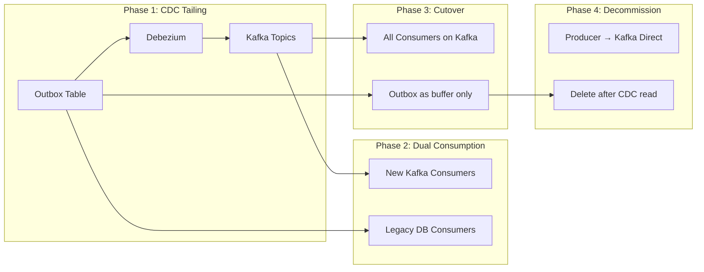

# Migration Roadmap: PostgreSQL Outbox → External Broker

## When to Migrate

> [!IMPORTANT]
> Migrate to Kafka/Pulsar when ANY of these conditions are met:
> - Sustained throughput > 20,000 events/second
> - Need for fan-out to > 10 consumer groups
> - Event replay requirement > 30 days
> - Multi-region/geo-distributed consumers
> - Strict ordering across partitions required

---

## Migration Phases



---

## Phase 1: CDC Tailing (Week 1-2)

### Objective
Read outbox changes via WAL without modifying application code.

### Implementation

1. **Deploy Debezium Connector**:
```json
{
  "name": "outbox-connector",
  "config": {
    "connector.class": "io.debezium.connector.postgresql.PostgresConnector",
    "database.hostname": "postgres-primary",
    "database.port": "5432",
    "database.user": "debezium",
    "database.password": "${secrets:db-password}",
    "database.dbname": "app",
    "table.include.list": "public.outbox",
    "transforms": "outbox",
    "transforms.outbox.type": "io.debezium.transforms.outbox.EventRouter",
    "transforms.outbox.route.by.field": "event_type",
    "transforms.outbox.table.expand.json.payload": "true"
  }
}
```

2. **Verify Replication Slot**:
```sql
SELECT slot_name, active, restart_lsn 
FROM pg_replication_slots 
WHERE slot_name = 'debezium';
```

3. **Monitor Lag**:
```sql
SELECT 
  slot_name,
  pg_size_pretty(pg_wal_lsn_diff(pg_current_wal_lsn(), restart_lsn)) AS lag
FROM pg_replication_slots;
```

---

## Phase 2: Dual Consumption (Week 3-4)

### Objective
Run both consumption paths simultaneously for validation.

### Implementation

1. **Create Kafka Consumer Groups**:
   - `outbox-legacy-shadow` (read-only, for comparison)
   - `outbox-new-primary` (processing, with feature flags)

2. **Shadow Mode Validation**:
```typescript
// Compare results without side effects
const legacyResult = await processViaDatabase(event);
const kafkaResult = await processViaKafka(event);

if (!deepEqual(legacyResult, kafkaResult)) {
  metrics.increment('shadow.mismatch');
  logger.warn('Mismatch detected', { eventId: event.id });
}
```

3. **Metrics to Track**:
   - Processing latency (DB vs Kafka)
   - Event ordering discrepancies
   - Duplicate detection rate

---

## Phase 3: Consumer Cutover (Week 5-6)

### Objective
Migrate all consumers to Kafka while keeping outbox as safety net.

### Implementation

1. **Feature Flag Rollout**:
```typescript
const useKafka = featureFlag.isEnabled('kafka-consumers', { 
  rolloutPercentage: 100 
});

if (useKafka) {
  await kafkaConsumer.process(event);
} else {
  await databaseConsumer.process(event);
}
```

2. **Disable Legacy Workers**:
```bash
# Graceful shutdown
kubectl scale deployment outbox-worker --replicas=0
```

3. **Outbox Becomes Buffer Only**:
   - Events are inserted but deleted immediately after CDC capture
   - Retention reduced to 1 hour

---

## Phase 4: Decommissioning (Week 7-8)

### Objective
Remove outbox table dependency from production path.

### Decision Point

| Approach | Atomicity | Complexity | Use When |
|----------|-----------|------------|----------|
| **Keep Outbox** | ✅ Full ACID | Medium | Cannot tolerate any data loss |
| **Direct Kafka Write** | ⚠️ At-most-once | Low | Idempotent consumers, high throughput |
| **Saga Pattern** | ✅ Eventual | High | Cross-service transactions |

### If Keeping Outbox (Recommended)

```sql
-- Aggressive cleanup after CDC capture
DELETE FROM outbox 
WHERE status = 'COMPLETED' 
  AND processed_at < NOW() - INTERVAL '1 hour';
```

### If Removing Outbox

```typescript
// Producer writes directly to Kafka
// ⚠️ ONLY if all consumers are idempotent!
await producer.send({
  topic: 'orders',
  messages: [{ 
    key: orderId, 
    value: JSON.stringify(event),
    headers: { 'idempotency-key': trackingId }
  }]
});
```

---

## Rollback Plan

At any phase, rollback is possible:

1. **Stop Debezium connector** (removes CDC)
2. **Restart legacy workers**
3. **Events still in outbox** will be processed normally

> [!CAUTION]
> During Phase 4, rollback requires re-deploying legacy infrastructure. Maintain runbooks for 90 days post-migration.

---

## Success Criteria

| Metric | Target |
|--------|--------|
| Zero DLE during migration | ✅ |
| Latency improvement | > 50% reduction |
| Consumer lag | < 1 second |
| WAL disk usage reduction | > 70% |
